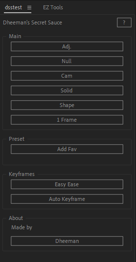

# Currently Working On -

- **Layer not on top Bug**
- **Instagram link not working**
- **Text layer Addition**
- **Multiple preset save option**
- **Preset save forever**

## **Maybe I will add this**
- **Custom UI**
- **Anchor Point**

# 🎨 Dheeman's Secret Sauce 🎨

Welcome to **Dheeman's Secret Sauce**! This After Effects script is designed to supercharge your workflow with a variety of powerful tools right at your fingertips.

## ✨ Features

- **Adjustment Layer**: Quickly add an adjustment layer.
- **Null Layer**: Insert a null layer with ease.
- **Camera Layer**: Create camera layers swiftly.
- **Solid Layer**: Add solid layers in a flash.
- **Shape Layer**: Generate shape layers effortlessly.
- **One Frame Adjustment**: Perfect for precise timing.
- **Favorite Presets**: Save and manage your favorite presets.
- **Keyframe Magic**: Easy Ease and auto keyframe functions to streamline animation.

## 🛠️ Installation

1. Download the script file [`dss.jsx`](./dss.jsx).
2. Place the file in your After Effects Script folder, typically located at:
   - **Windows**: `C:\Program Files\Adobe\Adobe After Effects <version>\Support Files\Scripts\`
   - **macOS**: `/Applications/Adobe After Effects <version>/Scripts/`
3. Restart After Effects if it is currently open.

## 🚀 Usage

1. Open After Effects.
2. Navigate to `File` > `Scripts` and select `Dheeman's Secret Sauce`.
3. A new panel will open with all the features listed above. Simply click the buttons to use the tools.

## 🖼️ Screenshots

## 🤝 Contributing

Contributions are welcome! Please fork the repository and submit a pull request with your improvements.

## 📜 License

This project is licensed under the MIT License. See the [LICENSE](./LICENSE) file for more details.

## 🔗 Links

- [Instagram](https://www.instagram.com/hotpauseee)

## 🙏 Acknowledgements

Special thanks to the After Effects scripting community for their inspiration and support.
